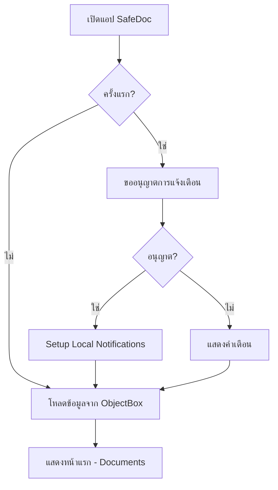
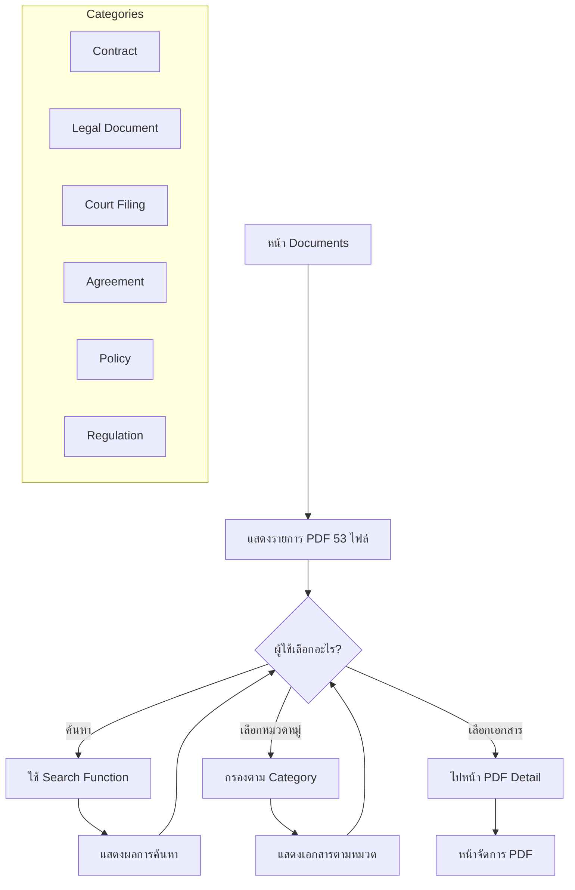
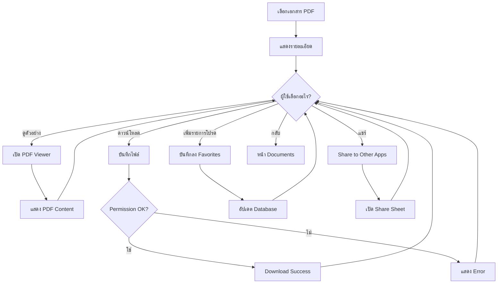
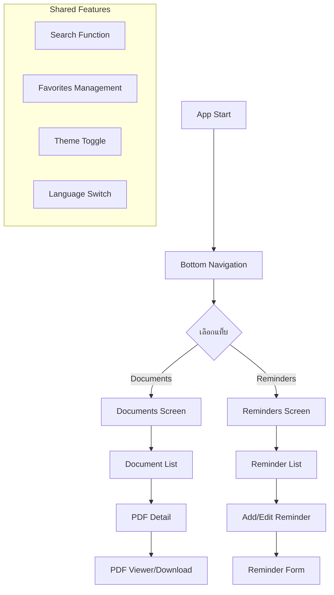
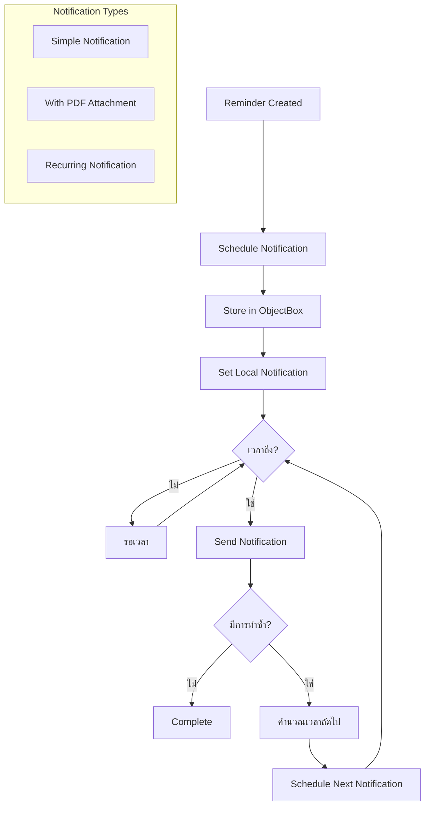
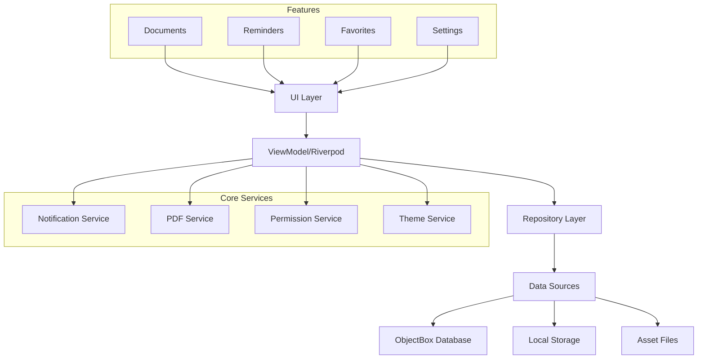
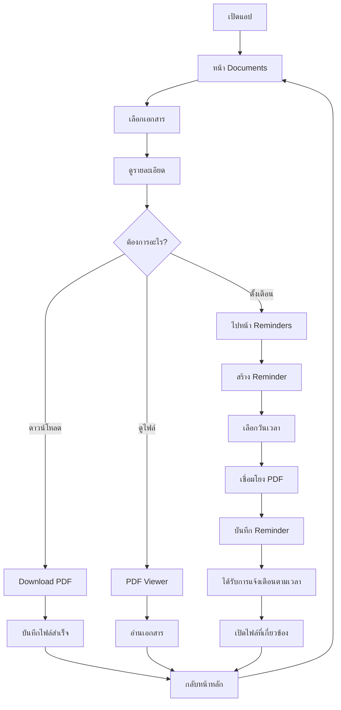
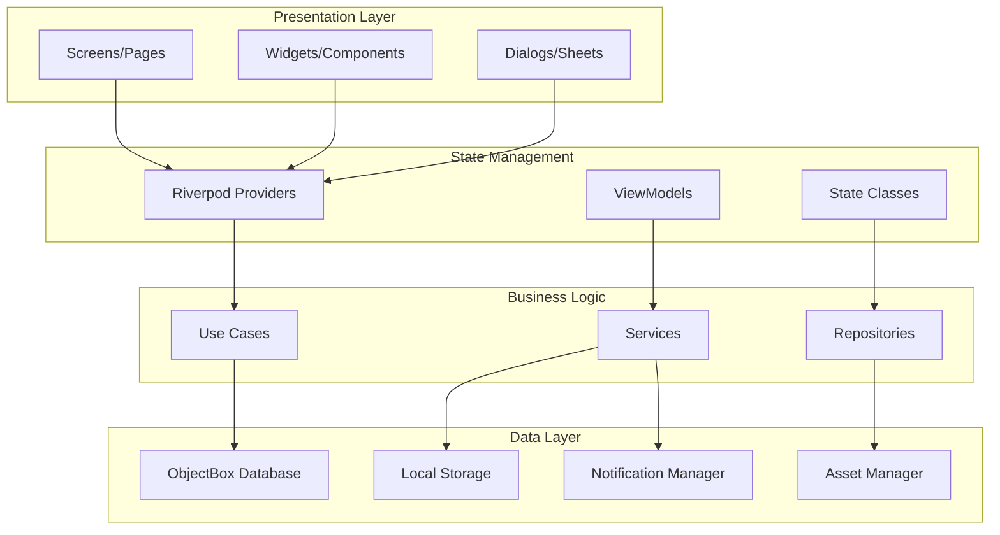

# SafeDoc App Flowchart

## 🔄 แผนผังการทำงานของแอปพลิเคชั่น SafeDoc

### 1. Flow การเริ่มต้นแอป (App Initialization)



### 2. Flow หน้าเอกสาร (Documents Screen)



### 3. Flow หน้าจัดการ PDF (PDF Management)



### 4. Flow หน้าการแจ้งเตือน (Reminder System)

```mermaid
graph TD
    A[หน้า Reminders] --> B[แสดงรายการ Reminders]
    B --> C{ผู้ใช้เลือกอะไร?}
    
    C -->|เพิ่มใหม่| D[หน้าสร้าง Reminder]
    C -->|แก้ไข| E[หน้าแก้ไข Reminder]
    C -->|ลบ| F[ยืนยันการลบ]
    C -->|เปิด/ปิด| G[Toggle Active Status]
    C -->|Settings| H[หน้า Notification Settings]
    
    D --> I[กรอกข้อมูล]
    I --> J[เลือกวันเวลา]
    J --> K[เลือกการทำซ้ำ]
    K --> L[เลือกไฟล์ PDF (Optional)]
    L --> M[บันทึกข้อมูล]
    
    subgraph "Repeat Options"
        K1[ไม่เกิดซ้ำ]
        K2[ทุกวัน]
        K3[ทุกสัปดาห์]
        K4[ทุกเดือน]
        K5[ทุกปี]
    end
    
    M --> N[Schedule Local Notification]
    N --> O[อัปเดต ObjectBox]
    O --> B
    
    E --> I
    F --> P{ยืนยัน?}
    P -->|ใช่| Q[ลบจาก Database & Cancel Notification]
    P -->|ไม่| B
    Q --> B
    
    G --> R[อัปเดตสถานะ]
    R --> B
```

### 5. Navigation Flow (Bottom Navigation)



### 6. Notification System Flow



### 7. Data Flow Architecture



### 8. Complete User Journey Flow



---

## 🏗️ Architecture Overview



## 📱 Key Features Flow Summary

1. **Document Management**: Browse → View → Download → Favorite
2. **Reminder System**: Create → Schedule → Notify → Repeat
3. **PDF Integration**: View → Download → Share → Link to Reminders
4. **Offline First**: All data stored locally using ObjectBox
5. **Responsive Design**: Adapts to Mobile, Tablet, iPad
6. **Localization**: Thai/English language support
